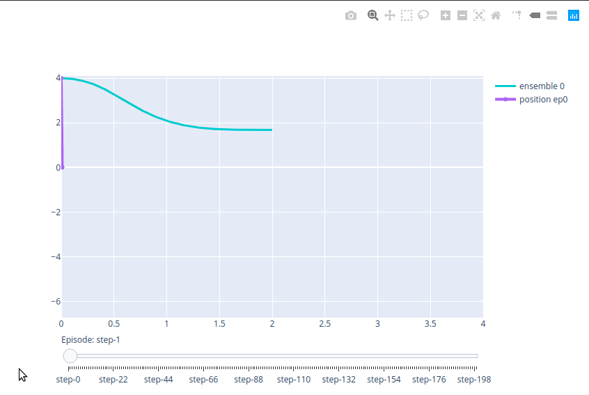
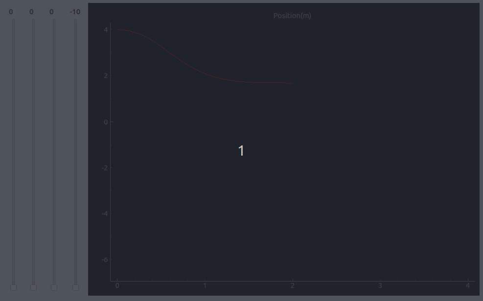

# Plot interactive graphs using python

## Packages analyzed

- Plotly: web-based, popular
- Matplotlib: no dependencies, not well documented, slow, ugly
- Bokeh: web-based, built on top of Matplotlib
- Pyqtgraph: fast, ugly, it can use other pyqt widgets 

Google Trends Comparison:


Plotly with by far the most popular, followed by Bokeh (I had to include the term python to all searches to avoid other meanings of Bokeh)

## Plotly

```bash
pip install plotly
```

It looks nice, easy to do simple things but harder for more complicated things


## Matplotlib
It does not look good and it is slow, but it is the easiest to use


## Bokeh

```bash
pip install bokeh
```

It looks very good but it is slow


## Pyqtgraph

```bash
pip install pyqt5 pyqtgraph
```

It is very fast and the syntax is easy. 

 

# First Prototype to our problem

Based on the previous analysis, plotly and pyqtgraph were tested for our data:

## 1D Landing Plotly Example

It is easy to plot one variable, but I struggled to plot more than one. It looks very slow even with only one variable
 

## 1D Landing Pyqtgraph Example

It was easy to change the plot and it is very fast
 


# 