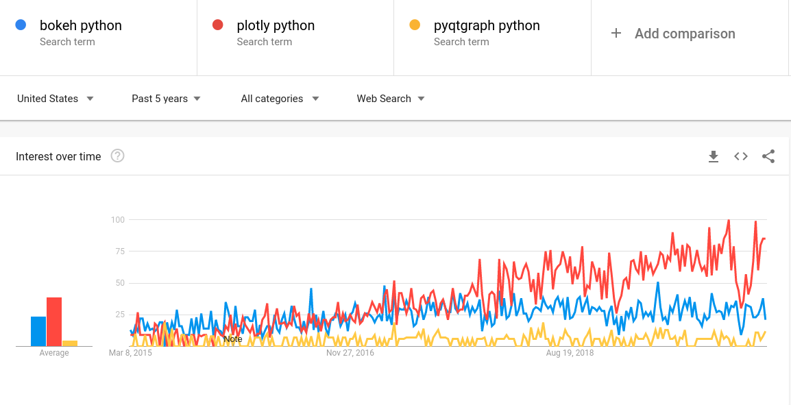
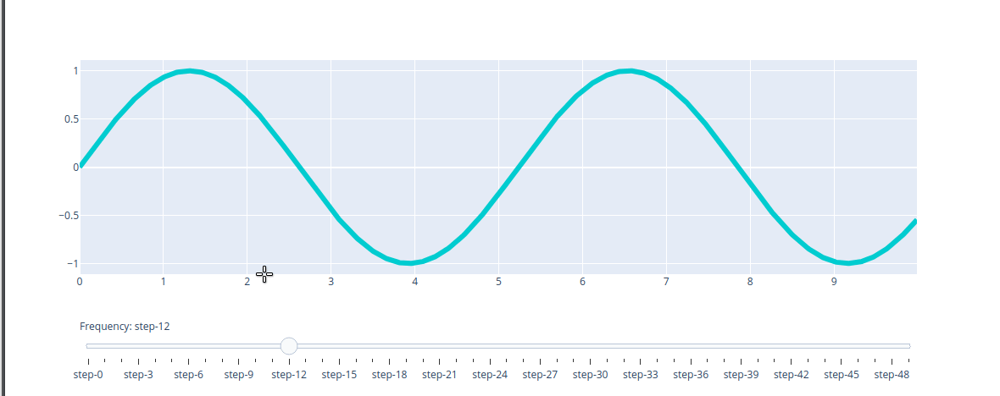
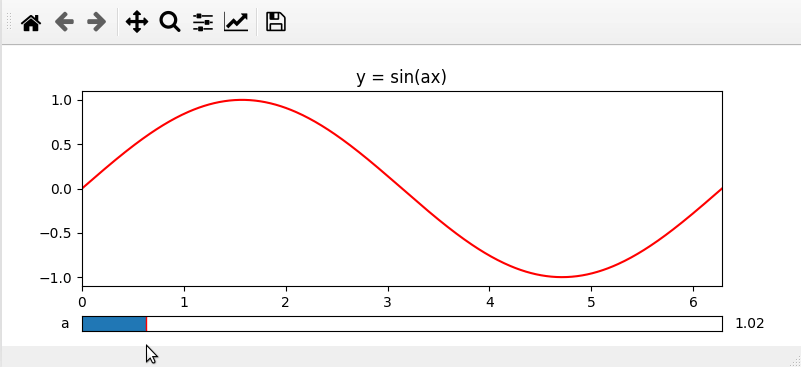
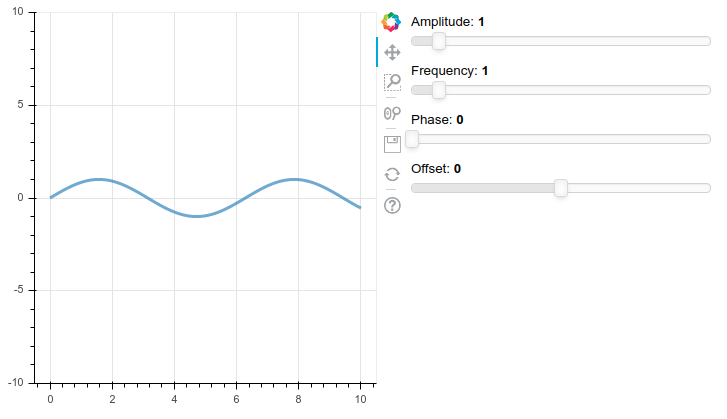
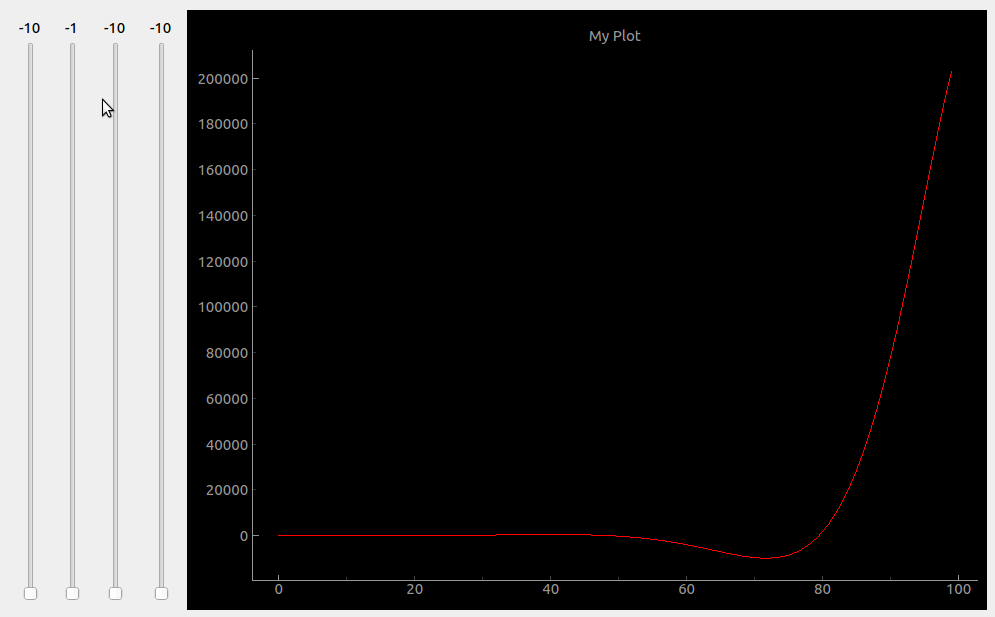

# Plot interactive graphs using python

## Packages analyzed

- Plotly: web-based, popular
- Matplotlib: no dependencies, not well documented, slow, ugly
- Bokeh: web-based, built on top of Matplotlib
- Pyqtgraph: fast, ugly, it can use other pyqt widgets 

Comparison


## Plotly

```bash
pip install plotly
```



## Matplotlib



## Bokeh

```bash
pip install bokeh
```



## Pyqtgraph

```bash
pip install pyqt5 pyqtgraph
```

  